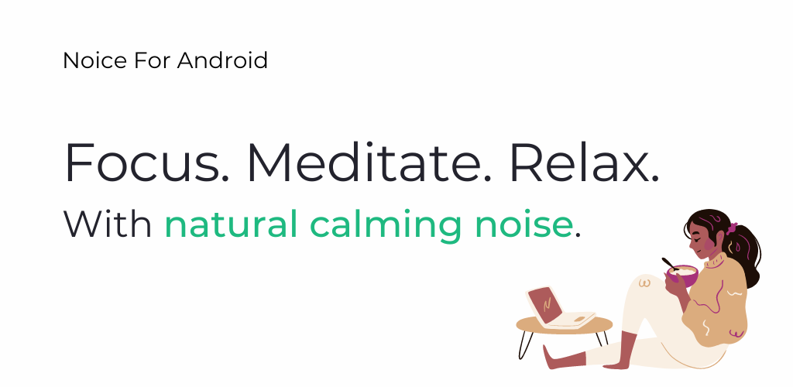
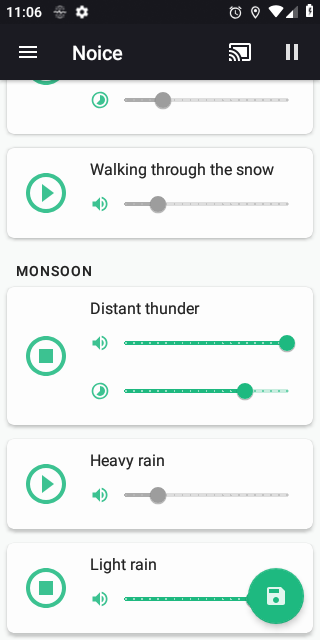
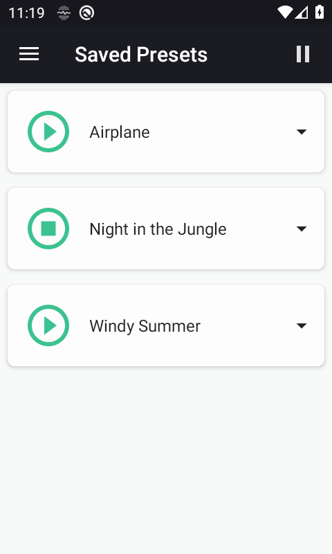
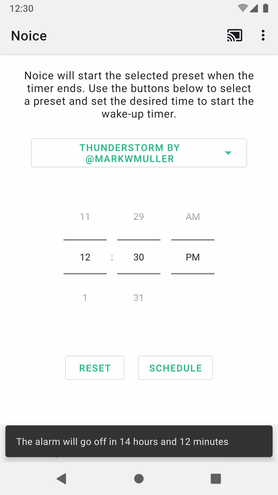
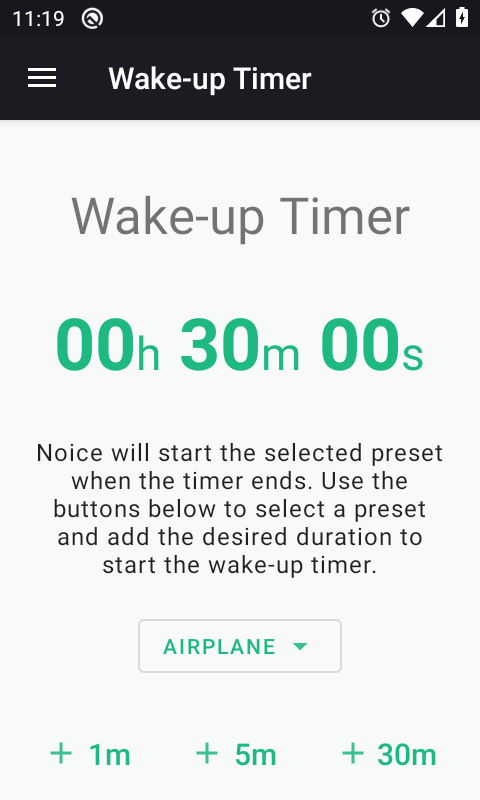
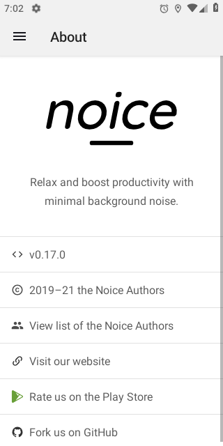
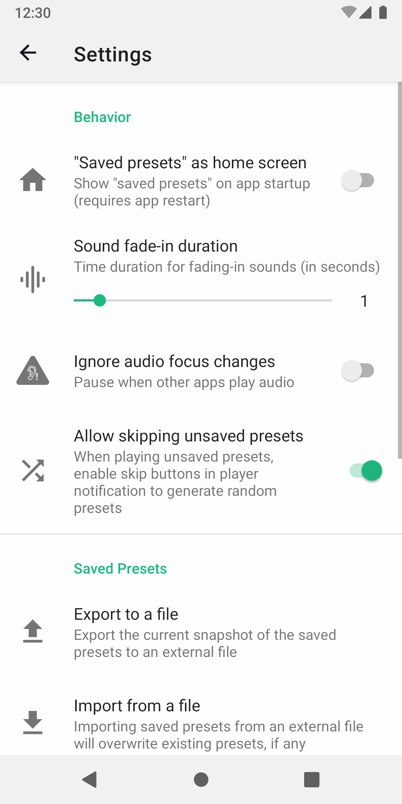
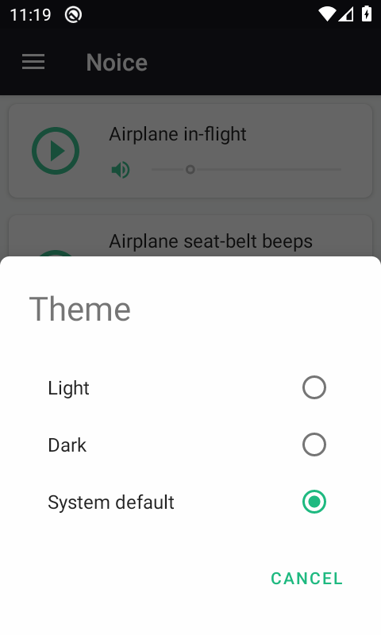

# 

[][google-play-link]

For a lot of people, a little background noise is helpful to calm down and focus. In some cases, it's also a boost to productivity. Background noise can also help minimize the effects of stress.

Noice is an app that allows you to create your own set of background sounds by mixing clips from environmental sources. Create your perfect surroundings by combining different sounds to drown out distractions so you can focus on your work, or generate serene, peaceful environments that encourage you to fall asleep.

## Download

[][f-droid-link]
[][google-play-link]

## Features

- 24 recorded noises
- Google Cast (Chromecast) enabled
- Auto sleep timer
- Wake-up timer (Alarm Clock)
- Make customised mix
- Save your favorite mixes
- Play alongside other music players
- Individual volume control for each noise source
- Offline playback

## Screenshots

|                                                                                |                                                                                |                                                                                |                                                                                |
| ------------------------------------------------------------------------------ | ------------------------------------------------------------------------------ | ------------------------------------------------------------------------------ | ------------------------------------------------------------------------------ |
|  |  |  |  |
|  |  |  |                                                                                |

## Contributing

We welcome contributions of all kinds and sizes. It includes everything from simple bug reports to huge features. See [CONTRIBUTING.md](docs/CONTRIBUTING.md) for details.

## Privacy Policy

Noice does not collect any data from its users. Selected third-party services handle all payments supporting the development of this project. For policies related to payments, users should refer to the privacy policy of the payment service they have chosen to use.

## License

[MIT](LICENSE)

[google-play-link]: https://play.google.com/store/apps/details?id=com.github.ashutoshgngwr.noice&referrer=utm_source%3DGitHub%26utm_campaign%3DREADME
[f-droid-link]: https://f-droid.org/app/com.github.ashutoshgngwr.noice
