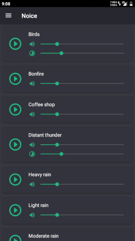
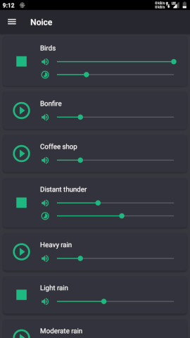
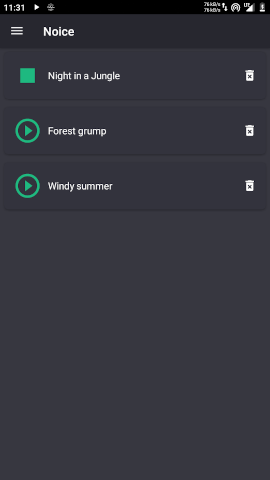
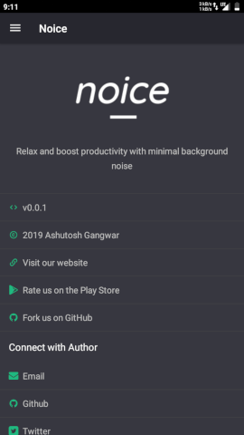

# 

[][google-play-link]

For a lot of people, a little background noise is helpful to calm down and focus. In some cases, it's also a boost to productivity. Background noise can also help minimize the effects of stress.

Noice is an app that allows you to create your own set of background sounds by mixing clips from environmental sources. Create your perfect surroundings by combining different sounds to drown out distractions so you can focus on your work, or generate serene, peaceful environments that encourage you to fall asleep.

## Download

[][f-droid-link]
[][google-play-link]

## Features

- 18 recorded noises
- Make customised mix
- Save your favorite mixes
- Play alongside other music players
- Individual volume control for each noise source
- Offline playback

## Screenshots

## Contributing

We welcome contributions of all kinds and sizes. This includes everything from simple bug reports to large features.

### Adding sounds

Android [SoundPool](https://developer.android.com/reference/android/media/SoundPool) has strict limitations on sound size. Please use < 10 seconds sounds at 32 kHz sample rate or < 15 seconds at 22 kHz. Test all sound changes to make sure if it is played correctly. Sounds might be chopped off if memory limits are exceeded.

Lower sample rates will allow longer playbacks but it is not recommended.

### Workflow

We love GitHub issues!

For small feature requests, an issue first proposing it for discussion or demo implementation in a PR suffice.

For big feature requests, please open an issue to avoid wasting time on a feature that might need reworking.

Small pull requests for things like typos, bug fixes, etc are always welcome.

### DOs

- Let Android Studio do the code formatting.

- Include tests when adding new features. When fixing bugs, start with adding a test that highlights how the current behavior is broken.

## Privacy Policy

Noice does not collect any kind of data from users. Heck, it doesn't even connect to the Internet.

## License

[MIT](LICENSE)

[google-play-link]: https://play.google.com/store/apps/details?id=com.github.ashutoshgngwr.noice
[f-droid-link]: https://f-droid.org/app/com.github.ashutoshgngwr.noice
