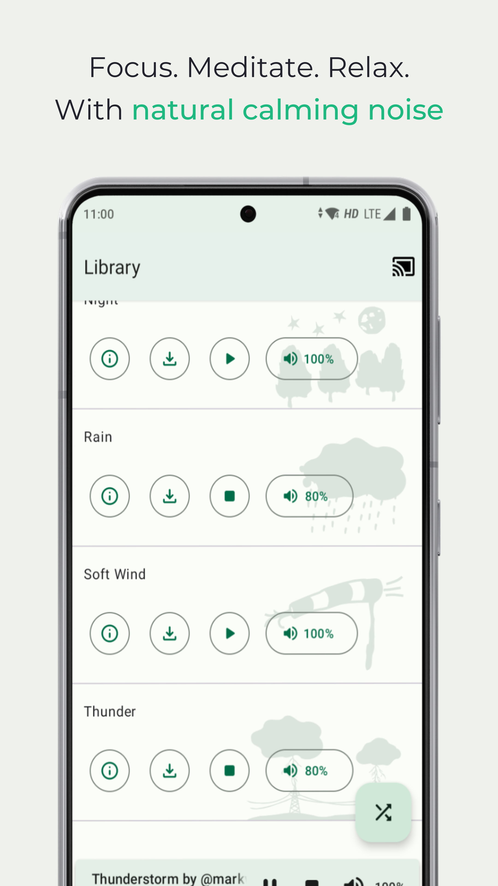
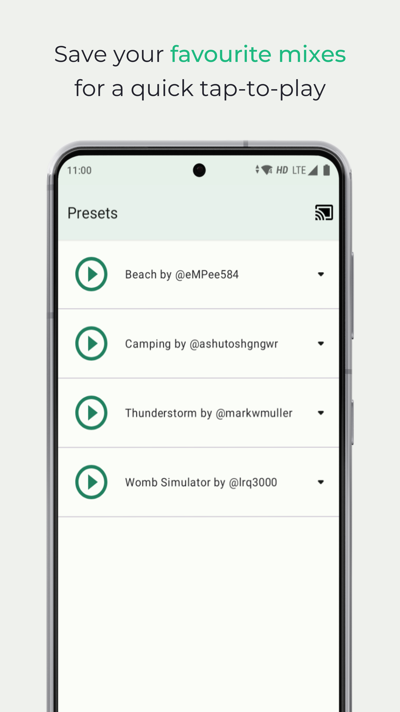

# 

[][google-play-link]

For a lot of people, a little background noise is helpful to calm down and focus. In some cases, it's also a boost to productivity. Background noise can also help minimize the effects of stress.

Noice is an app that allows you to create your own set of background sounds by mixing clips from environmental sources. Create your perfect surroundings by combining different sounds to drown out distractions so you can focus on your work, or generate serene, peaceful environments that encourage you to fall asleep.

## Download

[][f-droid-link]
[][google-play-link]

## Screenshots

|                                                                                |                                                                                |                                                                                |                                                                                |
| ------------------------------------------------------------------------------ | ------------------------------------------------------------------------------ | ------------------------------------------------------------------------------ | ------------------------------------------------------------------------------ |
|  |  |  |  |
|  |  |  |                                                                                |

## Documentation

1. See [`docs/CHANGELOG.md`](docs/CHANGELOG.md) for a brief history of the project
2. See [`docs/CONTRIBUTING.md`](docs/CONTRIBUTING.md) for workflow, app architecture and translation related documentation
3. See [`docs/CODE_OF_CONDUCT.md`](docs/CODE_OF_CONDUCT.md) for communication norms

## License

[MIT](LICENSE)

[google-play-link]: https://play.google.com/store/apps/details?id=com.github.ashutoshgngwr.noice&referrer=utm_source%3DGitHub%26utm_campaign%3DREADME
[f-droid-link]: https://f-droid.org/app/com.github.ashutoshgngwr.noice
