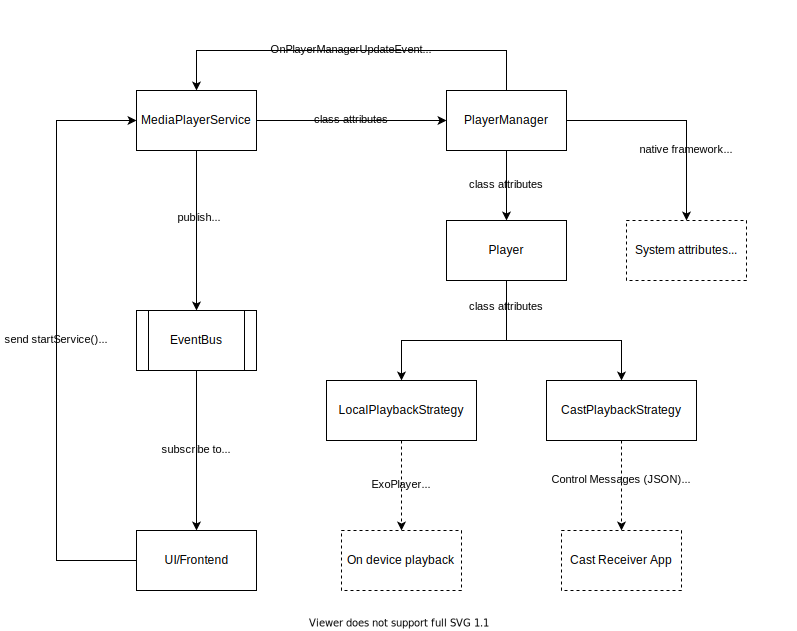

# Contributing <!-- omit in toc -->

We welcome contributions of all kinds and sizes. This includes everything from simple
bug reports to large features.

## Table of Contents <!-- omit in toc -->

- [Workflow](#workflow)
- [Getting started](#getting-started)
- [Translations](#translations)
- [Adding sounds](#adding-sounds)
- [Contributing code](#contributing-code)
  - [Architecture](#architecture)
    - [Android](#android)
    - [Cast Receiver](#cast-receiver)
  - [Best Practices](#best-practices)
- [Guiding Principles](#guiding-principles)
- [Releases](#releases)
  - [Play Store](#play-store)
  - [F-Droid](#f-droid)

## Workflow

- We love GitHub issues!
- For small feature requests, an issue first proposing it for discussion or demo
  implementation in a PR suffice
- For big feature requests, please open an issue to avoid wasting time on a feature
  that might need reworking
- Small pull requests for things like typos, bug fixes, etc are always welcome

## Getting started

1. Ensure that you have the latest Android SDK tools installed on your machine
1. Fork the repository to create a copy in your GitHub account. The forked repository
   should be accessible at `https://github.com/<your-username>/noice`
1. Clone the forked repository to your machine
1. Open the existing project using Android Studio or any editor of your choice

## Translations

Noice is currently being maintained by a single developer. To avoid context switches, I
have decided to accept translation contributions through GitHub only and will not be
using a dedicated service for Translations, such as [Weblate.org](https://weblate.org/),
in the foreseeable future.

Adding translations to Noice is rather easy on GitHub as well

1. Fork the repo
1. To create and edit a `strings.xml` file, you should ideally be using Android Studio.
   If you don't have Android Studio set up on your local machine, that's fine too.

   - To create a new `strings.xml` file using Android Studio

     1. Open the new file wizard under **File > New > Android resource file**
     1. From the **Available qualifiers**, add **Locale** to the **Chosen qualifiers**
     1. Select the correct language and region, and create the new `strings.xml` file

   - Use [this list](https://github.com/championswimmer/android-locales) to find
     the correct path for a new `strings.xml` file otherwise

1. Translate all the strings in `values/strings.xml`
1. If you're updating translations for an existing language, see
   [this issue](https://github.com/ashutoshgngwr/noice/issues/200) where we keep
   track of missing and potentially outdated translations.
1. Translate the F-Droid and Play Store metadata. See
   [docs](https://docs.fastlane.tools/actions/supply/#images-and-screenshots) and [an
   example](https://github.com/ashutoshgngwr/noice/tree/master/fastlane/metadata/android/pt-BR)

   - Do not add screenshots. Screenshots are generated using Fastlane before creating
     a release
   - Do not add `icon` as it is untranslated
   - You are free to create a `featureGraphic`. Its dimensions should be 1024wx500h and it
     should be opaque

1. Add your name to the translation credits section in the
   [`AboutFragment`](https://github.com/ashutoshgngwr/noice/blob/master/app/src/main/java/com/github/ashutoshgngwr/noice/fragment/AboutFragment.kt)

   - Add the required strings to the [`values/dont_translate.xml`](https://github.com/ashutoshgngwr/noice/blob/master/app/src/main/res/values/dont_translate.xml).
     See [example](https://github.com/ashutoshgngwr/noice/blob/9a4dce2330b3005acf88b4f6c95f9c4456766e75/app/src/main/res/values/dont_translate.xml#L68-L69)
   - Add the required item to the `TRANSLATIONS` array in
     [`AboutFragment`](https://github.com/ashutoshgngwr/noice/blob/master/app/src/main/java/com/github/ashutoshgngwr/noice/fragment/AboutFragment.kt).
     See [example](https://github.com/ashutoshgngwr/noice/blob/9a4dce2330b3005acf88b4f6c95f9c4456766e75/app/src/main/java/com/github/ashutoshgngwr/noice/fragment/AboutFragment.kt#L132-L135)
   - The naming convention for credit strings is as follows where the `index` is an integer denoting
     the number of revisions for a particular locale. For new locales, the `index` is 0. For
     existing locales, the `index` is its last value for that locale incremented by one.

     1. `credits__translation_<language code>_<region, if any>_<index>`: for descriptions
     2. `credits__translation_<language code>_<region, if any>_<index>__url`: for author's URL

1. Create a Pull Request proposing the new changes. On creating the pull request, Noice will
   run a set of GitHub actions that will check syntactical errors in the proposed changes.

## Adding sounds

Feel free to add more sounds to Noice taking the following under consideration.

- Looping sounds should be at least 30 seconds and at most 2 minutes long. These
  are not hard limits but the goal should be to minimize the ease of recognising
  recurring patterns in loops
- If a looping sound doesn't have too many recognisable notes, e.g. cricket
  sound, consider using dual samples. Dual samples make it hard to recognise
  repeating patterns. See [this
  issue](https://github.com/ashutoshgngwr/noice/issues/62) for more details.
- Consider applying the [Compressor
  effect](https://en.wikipedia.org/wiki/Dynamic_range_compression#Controls_and_features)
  to the new sounds. We recommend the following settings, but these do not
  produce the best results for all ambient sounds. To get best results, tweak
  these settings, test their output and trust your best judgement.
  - Threshold: -32 dB
  - Noise Floor: -70 dB
  - Ratio: 10:1
  - Attack Time: 0.10 sec
  - Release Time: 1 sec
- All sounds should be encoded to `mp3` format with the following configuration.
  I use [Audacity](https://www.audacityteam.org) for editing audio
  - Sample rate: 44.1 kHz
  - Bit rate mode: Average
  - Quality: Standard, 192 kbps
  - Variable Speed: Fast
  - Channel Mode: Stereo
- Once you have the sounds ready, copy the audio files to the
  [`assets`](https://github.com/ashutoshgngwr/noice/tree/HEAD/app/src/main/assets)
  directory and add them to the `LIBRARY` map in
  [`Sound.kt`](https://github.com/ashutoshgngwr/noice/blob/HEAD/app/src/main/java/com/github/ashutoshgngwr/noice/sound/Sound.kt),
  e.g.

  ```kotlin
  "birds" to Sound(
    // relative path of audio files in `assets` directory
    arrayOf("birds_0.mp3", "birds_1.mp3"),

    // title string resource
    R.string.birds,

    // sound group in which the sound should be placed
    R.string.sound_group__life,

    // an array of Pair instances where first string resource represents the description
    // of sound and second string resource represents the URL of sound's source. Both of
    // these resources are shown on the `About` screen of app.
    arrayOf(
      Pair(
        R.string.credits__sound_birds,
        R.string.credits__sound_birds_url
      )
    )
  )
  ```

## Contributing code

Most of the code is documented but not very thoroughly.

### Architecture

#### Android

The Android app is written in Kotlin. It does not adhere to modern architectures
(e.g. MVVM) or use modern frameworks. The rationale behind the choice was simple
&mdash; the view interactions are simple, and the views don't mutate too often.

The following diagram depicts the sound engine architecture in detail. Here
`MediaPlayerService` (a foreground service) controls a `PlayerManager` instance.
A `PlayerManager` controls multiple `Player` instances and can have at most one
`Player` instance for each sound present in the library.

<p align="center">
  <br>
</p>

#### Cast Receiver

The Cast receiver app is written in TypeScript. The TypeScript code transpiles
to the plain JavaScript to run in the Chromium instance on Chromecast devices.
The receiver app receives simple commands (JSON) from the `Player` component in
the Android app using Chromecast Sender and Receiver SDKs.

The receiver app has its `PlayerManager` implementation, which reacts to command
messages received from the sender Android app. The receiver app fetches the
audio from the internet instead of employing complicated mechanisms for
streaming audio over the local network. Hence, the sender app only needs to send
`soundKey`s with each of its control messages.

On receiving the following message, the `PlayerManager` on the receiver app will
immediately pause the [`Howl`](https://howlerjs.com/) instances corresponding to
the keys present in `src` array.

```json
{
  "src": ["birds_0.mp3", "birds_1.mp3"],
  "isLooping": true,
  "action": "pause",
  "volume": 0.3
}
```

<p align="center">
  <br>
</p>

### Best Practices

- Let Android Studio do the code formatting
- Add comments wherever you deem them necessary
- Include tests when adding new features
- When fixing bugs, start with adding a test that highlights how the current behaviour
  is broken. This is not mandatory since it is not always possible/approachable

## Guiding Principles

- We allow anyone to participate in our projects. Tasks can be carried out by anyone
  that demonstrates the capability to complete them
- Always be respectful of one another. Assume the best in others and act with empathy
  at all times
- Collaborate closely with individuals maintaining the project or experienced users.
  Getting ideas out in the open and seeing a proposal before it's a pull request helps
  reduce redundancy and ensures we're all connected to the decision-making process

## Releases

Noice is regularly updated on Google Play Store and F-Droid. A commit with the following
changes is necessary to prepare a new release.

1. It must bump app version name and code in `app/build.gradle`
2. It should add the release notes in `en-US` locale in the Fastlane metadata. Release notes are
   added to a new file at path `fastlane/metadata/android/en-US/changelogs/<version-code>.txt`
3. It should update the app's descriptive assets (Fastlane metadata) if required
4. It should update generated screenshots if required (`fastlane generate_screenshots`)

### Play Store

Noice uses [GitHub actions](https://github.com/ashutoshgngwr/noice/actions) to automatically
build and push releases to Google Play store.

- We have been strictly following [Semantic Versioning](https://semver.org) since 0.4.x
- New translations are considered as a feature
- All releases tagged in Git repository are pushed to beta track on the Play Store. After ample
  time, a release is manually promoted to the production track for general availability.
- In case a feature is merged into the master branch and a patch release needs to be created for
  the latest public release, create a temporary branch with pattern `Major.Minor.x` e.g., `1.1.x`.
  Tag any further patch releases to a commit in this branch. Before the next _non-patch_ release,
  the temporary branch can be merged into master.

### F-Droid

F-Droid releases are picked by its builder based on the latest tag. See
[the metadata file](https://gitlab.com/fdroid/fdroiddata/-/blob/master/metadata/com.github.ashutoshgngwr.noice.yml)
for more information.
